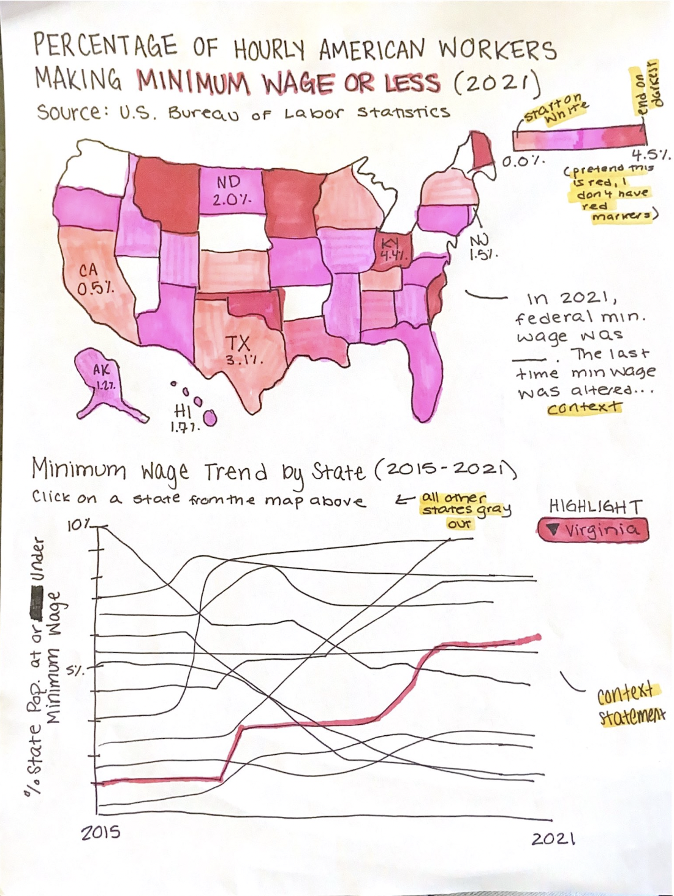

# Critique By Design: Federal Minimum Wage Comparisons
[Return to Home Page](/README.md)

## Original Visualization
I selected the following visualization largely due to the fact that they are statistics I have engaged with before and have seen commonly referenced in calls for _livable_ wages for all Americans. However, upon opening the link I was struck how relatively "basic" the visualization was, and how much more could be pulled from the dataset to support the subject at hand. In addition, for the purposes of this assignment, I wanted to select a visual that would challenge my ability to restructure aesthetics while not falling victim to my common tendancy to go overboard with content dumping. As will be revealed in the remainder of this analysis, this graphic was not only a topic I am passionate about in my personal life, but the perfect challenge to build my aesthetics-based data visualization skills. 

> **Visualization Source** Kiersz, Andy. "Amazon will Raise Workers' Minimum Wage to $15 an Hour, More Than Twice the Federal Minimum -- Here's How Many People in Each State Make Minimum Wage or Less." Personal Finance. _Business Insider_. March 4, 2019. https://www.businessinsider.com/federal-minimum-wage-workers-map-2018-10?r=US&IR=T. 

> **Data Source** U.S. Bureau of Labor Statistics. _Characteristics of Minimum Wage Workers, 2021_. April 2022. Distributed by the U.S. Bureau of Labor Statistics. https://www.bls.gov/opub/reports/minimum-wage/2021/home.htm.

## Data Visualization Effectiveness Profile (Stephen Few)
All of the following rankings are conducted on a scale of 0 to 10, with 0 being "worst" and 10 being "best" for each respective category.

### What visualization are you ranking? Provide the title and web-accessible URL.
"Workers Making Minimum Wage or Less" by Andy Kiersz using data from the U.S. Bureau of Labor Statistics for Business Insider. The particular iteration of the visualization created used U.S. Bureau of Labor Statistics data collected in 2017, distributed in 2018.
- **Link** https://www.businessinsider.com/federal-minimum-wage-workers-map-2018-10?r=US&IR=T

### Usefulness. _Is it useful for the intended audience? Does it communicate valuable information?_
- **Score:** 7
- At large, the visualization is useful within the scope of the article-- which is directly discussing how many people per state earn below the federal minimum wage within the context of Amazon raising its corporate minimum wage. The intended audience is those (who read Business Insider and are) interested in 1. wage distributions nationwide and/or within their state of residence, 2. Amazon as a company, or 3. both. Thus, the graphic is useful for its intended audience. Points on this scale were deducted due to the lack of clarity provided in the title and how small/difficult to read the caption is; the information being conveyed is indeed useful, however, the graphic's formatting reduces its usefulness slightly. The specifics of challenges initiated from formatting are explored more extensively in future sections.

### Completeness. _Does the visualization have everything necessary to make it understandable?_
- **Score:** 6
- The visualization  accomplishes visual clarity if only in the fact that there is _not_ an overabundance of data. However, what was sacrified in terms of visual simplicity invites a reduction in the overall comprehensibility or potential of the graphic. For example, something as simple as the creator's choice to title the piece "Workers Making Minimum Wage or Less" instead of something along the lines of "Percentage of Hourly American Workers Making Minimum Wage or Less" creates some confusion regarding exactly what the graphic's percentages are referencing. Further, what is important in the story is that Amazon is _increasing_ it's minimum wage in 2018, thus making change over time relevant to the discussion as a whole. The year in which data is drawn is not quickly clear on the graphic as it is located on the bottom of the image in a small font in gray text on a gray box following the source listing. Not only should this year be more prominent, but it would have been valuable in the context of the article to have some visualization of this percentage's change over time. Further, the graphic has a key, but this key would be more easily understandable and less questionable in its slightly uneven ranges if it was presented as a gradient instead of individual boxes. 

### Perceptibility. _Can the reader understand the information with minimal effort? Is the visualization type appropriate? Does it use illogical comparisons?_
- **Score:** 7
- As mentioned above, the information is generally comprehensible due to the relative simplicity that the creator was able to achieve. Ultimately, though this becomes the graphic's downfall, besides some spacing and sizing issues the information is _not_ difficult to parse. The choice of a Sans-Serif font is appropriate and does not feel out of place in the graphic itself, but it is an interesting choice to have the font family of the graphic in contrast with the Serif font family of the article's text. Likely, however, this was a style guide restriction from Business Insider that was not within the direct control of the creator. The only comparisons that exist in the visual are between states, and thus all comparisons are logical.

### Truthfulness. _Is the visualization accurate, reliable and valid?  Is it representing what it says it is, and in the most complete and truthful manner? Does it misrepresent the data or make comparisions that aren't correct?_
- **Score:** 9
- The graphic was certainly drawn from a reliable source, which is hyperlinked to the applicable dataset below the visualization. As touched on in the previous question, no illogical comparisons are made. There could be more clarity in the title, prominence of the context-providing caption, and potential presentation of percentage change over time, however the information that is included is overall valid and presented in a truthful manner. 

### Intuitiveness. _Is it easy to understand and clearly communicates the information? If unfamiliar, does it include easy to understand instructions on how to interpret it?_
- **Score:** 7
- Though somewhat exhaustively mentioned at this point, information is straigtforward and fits within the context of the article as a whole. The graphic is clearly representing variables per state on a sliding scale. However, increased clarity and context would be helpful in the title and repositioning of the context-providing caption. Color scaling is intuitive (the darker the color, the higher the number), but may be valuable to present in a color (or color scale) more associated with negative numbers (e.g. red having a connotation of something "bad" or "worse" than other options) or contextual connotations. In addition, using a continuous gradient for the key would be clearer than individual boxes and labels with differing ranges.

### Aesthetics. _It is interesting / enjoyable to look at? Is it a good example of what a beautiful data visualization might look like?_
- **Score:** 4
- Though neither unpleasant nor distracting, the graphic is not exciting to look at. Percentages of populations earning below minimum wage is certainly not an exciting topic, yet the information is valuable and calls to be presented in a dynamic fashion that will be inviting for readers to engage with and learn from. Further, it is odd and somewhat distracting that all component text, excluding the source/caption, appears to be bolded. Aesthetically, the visualization is quite "flat" and not enjoyable to engage with or learn from. Increased stylization (to an appropriate degree given the subject matter, of course) and variation in color, text placement, and text sizing/bolding alongside the possible presentation of more information either on the graphic or in a larger dashboard would make the work more engaging and interesting.

### Engagement. _Does it lead the audience to learn more about the topic?  Does it inspire the audience to talk about the data or share it with others?_
- **Score:** 3
- Intuitively, this is an extremely important topic with massive real-world implications; readers should be able to understand that Amazon's internal move to raise minimum wage should not be an outlier in the corporate world. Given how "flat" and non-engaging this visual is, it does not inspire audiences to want to learn more or grasp the high importance of the topic. Though information needs to be presented truthfully and objectively, it needs to be dynamic enough to not just cause audiences to think "it is what it is" or "I suppose this doesn't really affect anyone." Aesthetic and organizational changes, as well as an option to engage more heavily with the dataset, may help inspire audiences to learn more about the topic or share the findings with others.

### Describe your overall observations about the data visualization here.  What stood out to you?  What did you find worked really well?  What didn't?  What, if anything, would you do differently?  
Given the above rankings and their explanations provided on this page, while the data visualization is generally useful, intuitive, and easily comprehensible, it lacks in terms of **aesthetics, engageability, and holistic usage of the available dataset**. In particular, the visualization is successful in not being overly cluttered or confusing in terms of what information is being presented. Though the graphic could benefit from more centrally featuring the words "percentage" or "hourly" in the title, making the context-providing caption easier to read, altering the color grading, and providing more variation in bolding and text size, the data itself is straightforward and appears to be reported truthfully per the U.S. Bureau of Labor Statistics dataset. On the other side, however, the article suggests that Amazon's move to raise its national minimum wage should not be an outlier for companies operating in the U.S., and as such the percentages of Americans earning below minimum wage are staggering and deserve to be talked about. Yet, the graphic is neither dynamic nor effective in motivating further engagement by audiences with the dataset or information provided by the piece. In addition to the aesthetic and organizational shortcomings already mentioned, the graphic could benefit from preventing **more** data either on the graphic or in a dashboard format while still maintaining the comprehensibility of the key figure. In particular, as the article focuses on change made by Amazon, it would be interesting to use the dataset to highlight change in these percentages over time. As a whole, I look forward to using this strong informational base to alter aesthetics and organizational presentation to highlight the importance and scale of the topic in the U.S. at large.

### Who is the primary audience for this tool? Do you think this visualization is effective for reaching that audience? Why or why not?
As first mentioned in the "usefulness" analysis, the intended audience is realistically those (who read Business Insider and/or are searching for articles on the respective topic) that are) interested in 1. wage distributions nationwide and/or their state of residence, 2. Amazon's business practices and corporate trends, or 3. both. Given how straightforward the graphic is, the visualization is effective for reaching this audience in its simplicity and objective presentation of the data. Yet, once again, increased context could be valuable for any viewer, regardless of their background. In addition, the serious tone of the visualization is appropriate for this identified audience. However, this tone causes it to be rather non-engaging and "flat" for a topic that is quite dynamic; audiences may want more data or analysis provided within the article to satisfy their needs as readers. 

### Final thoughts: _How successful what this method at evaluating the data visualization you selected? Are there measures you feel are missing or not being captured here?  What would you change?  Provide 1-2 recommendations (color, type of visualization, layout, etc.)_
This method was quite successful for me as it was necessary to think about different elements of the visualization slowly and systematically, which led to me uncovering certain needs as I went along. The system led me to not brashly think about what was "good" or "bad" in a binary fashion, but rather about what particular elements are already strong or could be improved to strengthen the work as a whole. Without this method, it would have been more difficult for me to determine that primary issues with this visualization lay in its aesthetics, ability to inspire engagement, and amount of data the creator chose to include, not necessarily the organization or objectivity of the data itself. Given the visualization I chose, I am satisfied with the included measures. My only suggestion would perhaps be a range that pertains specifically to the availability of needed **context** in order to get evaluators thinking about the placement, sizing, and length of provided (or missing) context on the visual itself. For this specific visualization my initial suggestions, which I will strategize and build out in the forthcoming section, are as follows:
* Change the individual key boxes with inconsistent ranges to a color gradient scale.
* Provide more context in the title (e.g. "Percentage of Hourly American Workers Making Minimum Wage or Less")
* Reposition the caption to provide more key context within the visualization-proper
* Unbold select portions of text to make key information or headings (perhaps state abbreviations) pop
* Make the visual more dynamic by allowing viewers to scroll over or highlight states to draw out more specified information (perhaps, remove state abbreviations _or_ **percentages** to make the map less cluttered and allow viewers to pull out information as they desire)
* Include some representation of **change over time** (either on the visualization or in a dashboard format)
* Rework the color grading scale to be more bold and in line with the "negative connotation" of these values
* Introduce more Serif fonts to match the style of the article itself

## Sketch a Solution
Following the above analysis, I sketched a draft of how the graphic could be improved. Ultimately, I landed on maintaining the simple map format, but providing another interactive element below the map to highlight change over time for individual states in the United States. As notated on the quick drawing, context statements will be provided and there will be an updated color palette. For the sketch, I worked with the colors I had in my collection (as can be seen, largely pink), and sought more insight for color palettes from my peers in our forthcoming discussions. The following image was presented to those from whom I received feedback without any additional context from myself.

### Feedback #1: Adult, early-50s
**What is this data visualization sketch telling you?** "The graphic is showing the percentage of hourly American workers making minimum wage or less in 2021 based on their geographical location using a map. This makes me look for trends in areas/regions across the country. The graph below the map makes it simple to look for those trends by state and deepen my understanding of what has occurred."

**Do you find anything surprising or confusing in the layout?** "The layout is simple and straight forward. It isn’t confusing at all to read. I am wondering if you are “saying something” with the states you chose to specifically name the percentage for (Alaska, California, Kentucky, etc.) Were these randomly selected or are you sending the reader a message?"

**Who do you think is the intended audience for this visual?** "I think the audience would be anyone wanting to share accurate information about the percentage of the population making minimum wage or less (political candidates, activists, government officials, social workers, support focused agencies, etc.)"

**Is there anything in particular that works or doesn’t work? Why or why not? What would you differently?** "I would consider changing the color palette to something that could be easily transferred to a black and white copy. Also, pinks and purples tend to be “cheery” colors and this isn’t a “happy topic”. (I understand your color choices were limited for this graphic.) I love the graph that shows trends by state. This makes it so someone doesn’t only see the current situation but they can make predictions about what could happen in the future."

### Feedback #2: Adult, early-60s
**What is this data visualization sketch telling you?** 
* "Is this a trick question?"
* "In terms of intent, the graphics compare the percentage of wage earners receiving minimum wage (or less) by state in 2021, as well as the changes by state from 2015 through 2021."
* "In terms of “message,” the implication of the graphics are unclear.  Is there a finding beyond the fact that the percentage of people working for minimum wage (or less) varies by state?  It’s difficult to draw a conclusion."

**Do you find anything surprising or confusing in the layout?** "Yes. Something isn’t lining up in the map, which makes analyzing the information difficult. Ohio appears to be labeled Kentucky (or perhaps, Ohio is missing altogether, with western Pennsylvania abutting a blank space.  Maryland and West Virginia also appear to have gone missing.  This may or may not matter once the context is described. With no context, it’s difficult to understand the meaning of the data beyond the simple percentages for each state.  The stats for Virginia, for instance, could be a good thing (e.g., there was a dramatic increase in the number of new businesses paying minimum wage, which offered new opportunities for people who wanted part-time work, as well as increased tax revenue), or a bad thing (e.g., economic conditions forced more people to accept low-wage jobs)."

**Who do you think is the intended audience for this visual?** "Again, the first graphic in particular seems to represent baseline data that could be overlayed with any number of other factors – laws governing minimum wage, average income, cost of living, public assistance laws, etc.  Thus, the intended audience (at least for the first graphic) appears to be anybody wishing to identify trends resulting from any number of policies.  The second graphic suggests the intended audience will be policy makers or fair-pay advocates, but again, that would be determined by the context, which is not included."

**Is there anything in particular that works or doesn’t work? Why or why not? What would you differently?** "Red is often associated with problems or delays (e.g., a classic red-yellow-green status chart).  If the graphic is intended to suggest that the higher percentages are problematic, this works, but if the percentages as a whole are to be regarded as neutral, the red may not be the best color selection."

### In-Class Feedback
During class, my peers validated that the message of both graphics were clear with reasonable headlines and easily comprehensible color schemes. All of my peers connected that the redder the color, the worse the situation-- even before necessarily understanding the precise context of the graphic itself. The central suggestion was to include a list of "top 5 or 10 states" by percentage at or above minimum wage either within the article or next to the visualization in order to answer any questions that may arise with the "closeness" of different colors on the overall scale. Given the current state of the visual, I would imagine this being integrated as an extra caption in the article-proper, not creating more "cluttering" words on the graphic itself.

### Analysis
The visualization generally seems to be easily parseable in topic, which was valuable to hear as one of my main goals was to maintain the easy comprehensibility of the graphic at hand. The only large confusion the first and second respondants alike was regarding which states were labeled on my mock-up sketch, which will be easily solved when all the states are actually represented on the visualization. In my prompted lack of provided context regarding the sketch to my participants, I forgot to draw out the fact that this was just a mock-up with a clearly not (even close to) perfect U.S. map.

I enjoyed the feedback from the first respondant that they saw the visualization as a potential tool, rather than just a tidbit of knowledge within the context of the article at hand. This was built off of by the second respondant in their belief that the first visual of the two was for more generalized use targeted at anyone interested in the topic, but the second more specifically for policy makers or fair-pay advocates.

Changes I will preominently adopt to following this feedback are as follows: 
* Alter the color palette to something less "cheery" and/or bright that may be readily converted to black-and-white if needed
* Make sure that there are enough color variations in the key to make values easily distinguishable from each other (4 or 5 distinct scaled colors in the gradient is not enough)
* I will add more context to the top graph, drawing out (but not outwardly stating) the fact that the lack of change in minimum wage is **bad**, and thus justifies the negatively-connotated color.

## New Visualization(s)
I was able to adapt a large portion of my original ideas, as well as the feedback suggestions from participants, into my final visualization developped using Tableau and U.S. Bureau of Labor Statistics data. 

Major changes I worked to integrate on my recreation of the initial visualization are as follows:
* Altered the color scheme from blue to red, in order to draw out the _negative connotation_ of the numbers as they continue to increase (the darker the red, the "worse" the implication for workers in the respective states.)
* Made the title more specific in order to draw out a more accurate picture of what the data represents, as well as highlight the fact that the data is relative to **federal** minimum wage, not necessarily higher minimum wages set within individual states. (As will be seen, these disperate minimum wages per state are drawn out in the extra visualization I ended up creating)
* Added a context statement next to the recreation of the initial graphic that is not leading towards any potentially biasing opinion or conclusion, but adds a time-based context to explain the severity of the data represented.
* Made the graphic as a whole interactive and bolder in order to make it more engaging.
* Put the color gradient in the key on a continous scale with clear intervals, rather than individual boxes with mismatched ranges.
* Moved the year of data represented into the title, rather than hidden in the caption to increase data transparency.
* Put only the state "code" abbreviation on the states rather than the state code _and_ the relevant percentage, as the color grading makes the distribution rather self explanatory and the presence of only one label per state reduces clutter. If readers are interested, they can scroll over or click on states to learn more, which also increases the ability to engage with the visual while still keeping it perfectly comprehensible in its base form.
* Unbolded a majority of information, and used color to make only the important information really "pop" against the remainder of the visualization.
* Introduced more Serif fonts to match the variation in key fonts on the website for which the visualization was created.

Upon reflection of what I wished to accomplish with this exercise, however, I realized I wanted to be able to draw out the change over time for individual states in relation to the key percentages, as data this existed in the same U.S. Bureau of Labor Statistics report and would add valuable context to the current (2021) presentation of data. For this reason, I chose to add a second graphic to a "dashboard" in a matching color scheme on which users can dynamically **highlight** a state to draw out its individual changes in percentages of hourly workers earning at or less than minimum wage between 2015 and 2021. Under much consideration, I added a title that could make the graphic stand on its own if needed or taken out of context and strayed from providing additional "caption-based" context that ultimately ended up (in drafts) being overly convoluted, long, and cluttered for the story the visualization tells. 

The only major shortcoming that I was unable to fully address at my current level of expertise was creating a link between the first and second graphs; it would have been ideal to have clicking on a state on the first graphic correlate with the highlighting (in a matching color) on the second graphic of the same state. Sadly, while endless online forums did not prove ultimately helpful in addressing this desire, with hope my continued work with Tableau will unlock the key to achieving this function. I believe that the visual is still effective, but I acknowledge that there is room for improvement as my knowledge base continues to expand.

Finally, though not influenced by and discovered after the creation of this first design, I found that my final visualization ended up quite similar to a [Makeover Monday submission](https://public.tableau.com/app/profile/matteo2748/viz/MakeoverMonday-USMinimumWages/Dashboard2) by Matteo Reddavide on May 3, 2023. In fact, this creator was able to accomplish some of the color matching (between the state on map and state trend over time) I was interested in achieving between the two parts of the visualization, and thereby serves as a strong representation of what I was attempting to achieve in that element.

<noscript></noscript><object class='tableauViz'  style='display:none;'><param name='host_url' value='https%3A%2F%2Fpublic.tableau.com%2F' /> <param name='embed_code_version' value='3' /> <param name='site_root' value='' /><param name='name' value='CritiquebyDesign_16999024733270&#47;CritiquebyDesignDashboard' /><param name='tabs' value='no' /><param name='toolbar' value='yes' /><param name='static_image' value='https:&#47;&#47;public.tableau.com&#47;static&#47;images&#47;Cr&#47;CritiquebyDesign_16999024733270&#47;CritiquebyDesignDashboard&#47;1.png' /> <param name='animate_transition' value='yes' /><param name='display_static_image' value='yes' /><param name='display_spinner' value='yes' /><param name='display_overlay' value='yes' /><param name='display_count' value='yes' /><param name='language' value='en-US' /><param name='filter' value='publish=yes' /></object>
                

After working through this first visualization, I realized that understanding individual state minimum wages (either 1. made explicitly above the federal minimum wage, 2. made explicitly the same as the federal minimum wage, or 3. implicitly existing as the same as the federal minimum wage) was key to this discussion. Visualizing which states do or do not have an internal minimum wage higher than that of the federally set wage helps inform the percentages found in the initial graphic. For this reason and out of my own curiousity, I pulled another dataset last updated in September 2023 from the U.S. Bureau of Labor Statistics to visualize in a similar fashion to the first graphic the current minimum wages in effect per state. Once again, context was important to this discussion and was provided to the right of the U.S. map; while some states have an internally set minimum wage above the federal level, this **does not mean** that they are addressing the **average cost of living** in the nation. Green was chosen due to its general association with U.S. currency, and a "heat map" with state listings is provided next to the map visual for added clarity (the "greener" the color, the higher the "monetary" value connection). I feel this visualization is a worthwhile supplement to the key redesign of the present assignment, and I enjoyed working further with what I have been teaching myself about map-based graphics and dashboards in Tableau. 

<noscript></noscript><object class='tableauViz'  style='display:none;'><param name='host_url' value='https%3A%2F%2Fpublic.tableau.com%2F' /> <param name='embed_code_version' value='3' /> <param name='site_root' value='' /><param name='name' value='MinimumWagebyState_16999024269890&#47;Dashboard1' /><param name='tabs' value='no' /><param name='toolbar' value='yes' /><param name='static_image' value='https:&#47;&#47;public.tableau.com&#47;static&#47;images&#47;Mi&#47;MinimumWagebyState_16999024269890&#47;Dashboard1&#47;1.png' /> <param name='animate_transition' value='yes' /><param name='display_static_image' value='yes' /><param name='display_spinner' value='yes' /><param name='display_overlay' value='yes' /><param name='display_count' value='yes' /><param name='language' value='en-US' /><param name='filter' value='publish=yes' /></object>
                

