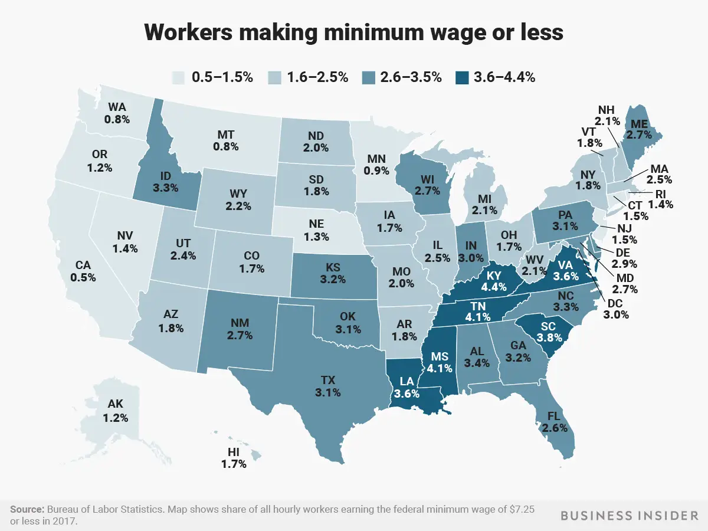

# Critique By Design: Federal Minimum Wage by State
## Original Visualization

> **Visualization Source** Kiersz, Andy. "Amazon will Raise Workers' Minimum Wage to $15 an Hour, More Than Twice the Federal Minimum -- Here's How Many People in Each State Make Minimum Wage or Less." Personal Finance. _Business Insider_. March 4, 2019. https://www.businessinsider.com/federal-minimum-wage-workers-map-2018-10?r=US&IR=T. 

> **Data Source** U.S. Bureau of Labor Statistics. _Characteristics of Minimum Wage Workers, 2021_. April 2022. Distributed by the U.S. Bureau of Labor Statistics. https://www.bls.gov/opub/reports/minimum-wage/2021/home.htm.

## Data Visualization Effectiveness Profile (Stephen Few)
All of the following rankings are conducted on a scale of 0 to 10, with 0 being "worst" and 10 being "best."

### What visualization are you ranking? Provide the title and web-accessible URL.
"Workers Making Minimum Wage or Less" by Andy Kiersz using data from the U.S. Bureau of Labor Statistics for Business Insider. The particular iteration of the visualization created used U.S. Bureau of Labor Statistics data collected in 2017, distributed in 2018.
- **Link** https://www.businessinsider.com/federal-minimum-wage-workers-map-2018-10?r=US&IR=T

### Usefulness. _Is it useful for the intended audience? Does it communicate valuable information?_
- **Score:** 7
- At large, the visualization is useful within the scope of the article-- which is directly discussing how many people per state earn below the federal minimum wage within the context of Amazon raising its corporate minimum wage. The intended audience is those (who read Business Insider and are) interested in 1. wage distributions nationwide or within their state of residence, 2. Amazon as a company, or 3. both. Thus, the graphic is useful for its intended audience. Points on this scale were deducted due to the lack of clarity provided in the title and how small/difficult to read the caption is; the information being conveyed is indeed useful, however, the graphic's formatting reduces its usefulness slightly. The specifics of challenges initiated from formatting are explored more extensively in future sections.

### Completeness. _Does the visualization have everything necessary to make it understandable?_
- **Score:** 6
- The visualization  accomplishes visual clarity if only in the fact that there is _not_ an overabundance of data. However, what was sacrified in terms of visual simplicity invites a reduction in the overall comprehensibility or potential of the graphic. For example, something as simple as saying choosing to title the piece "Workers Making Minimum Wage or Less" instead of "Percentage of Hourly American Workers Making Minimum Wage or Less" creates some confusion regarding exactly what the graphic's percentages are referencing. Further, what is important in the story is that Amazon is _increasing_ it's minimum wage in 2018, thus making change over time relevant to the discussion as a whole. The year in which data is drawn is not quickly clear on the graphic as it is located on the bottom of the image in a small font in gray text on a gray box following the source listing. Not only should this year be more prominent, but it would have been valuable in the context of the article to have some visualization of this percentage's change over time. Further, the graphic has a key, but this key would be more easily understandable and less questionable in its slightly uneven ranges if it was presented as a gradient instead of individual boxes. 

### Perceptibility. _Can the reader understand the information with minimal effort? Is the visualization type appropriate? Does it use illogical comparisons?_
- **Score:** 7
- As mentioned above, the information is generally comprehensible due to the relative simplicity that the creator was able to achieve. Ultimately, though this becomes the graphic's downfall, besides some spacing and sizing issues for context the information is _not_ difficult to parse. The choice of a Sans-Serif font is appropriate and does not feel out of place in the graphic itself, but it is an interesting choice to have the font family of the graphic in contrast with the Serif font family of the article's text. Likely, however, this was a style guide restriction from Business Insider that was not within the direct control of the creator. The only comparisons that exist in the visual are between states, and thus all comparisons are logical.

### Truthfulness. _Is the visualization accurate, reliable and valid?  Is it representing what it says it is, and in the most complete and truthful manner? Does it misrepresent the data or make comparisions that aren't correct?_
- **Score:** 9
- The graphic was certainly drawn from a reliable source, which is hyperlinked to the applicable dataset below the visualization. As touched on in the previous question, no illogical comparisons are made. There could be more clarity in the title, prominence of the context-providing caption, and potential presentation of percentage change over time, however the information that is included is overall valid and presented in a truthful manner. 

### Intuitiveness. _Is it easy to understand and clearly communicates the information? If unfamiliar, does it include easy to understand instructions on how to interpret it?_
- **Score:** 7
- Though somewhat exhaustively mentioned at this point, information is straigtforward and fits within the context of the article as a whole. The graphic is clearly representing variables per state on a sliding scale. However, increased clarity and context would be valuable in the title and repositioning of the context-providing caption. Color scaling is intuitive (the darker the color, the higher the number), but may be valuable to present in a color (or color scale) more associated with negative numbers (e.g. red having a connotation of something "bad" or "worse" than other options) or contextual connotations. In addition, using a continuous gradient for the key would be clearer than individual boxes and labels with differing ranges.

### Aesthetics. _It is interesting / enjoyable to look at? Is it a good example of what a beautiful data visualization might look like?_
- **Score:** 4
- Though neither unpleasant nor distracting, the graphic is not exciting to look at. Percentages of populations earning below minimum wage is certainly not an exciting topic, yet the information is valuable and calls to be presented in a dynamic fashion that will be inviting for readers to engage with and learn from. Further, it is odd and somewhat distracting that all component text, excluding the source/caption, appears to be bolded. Aesthetically, the visualization is quite "flat" and not enjoyable to engage with or learn from. Increased stylization (to an appropriate degree given the subject matter, of course) and variation in color, text placement, and text sizing/bolding as well as the possible presentation of more information either on the graphic or in a larger dashboard would make the work more engaging and interesting.

### Engagement. _Does it lead the audience to learn more about the topic?  Does it inspire the audience to talk about the data or share it with others?_
- **Score:** 3
- Intuitively, this is an extremely important topic with massive real-world implications; readers should be able to understand that Amazon's internal move to raise minimum wage should not be an outlier in the corporate world. Given how "flat" and non-engaging this visual is, it does not inspire audiences to want to learn more or grasp the high importance of the topic. Though information needs to be presented truthfully and objectively, it needs to be dynamic enough to not just cause audiences to think "it is what it is" or "I suppose this doesn't really affect anyone." Aesthetic and organizational changes, as well as an option to engage more heavily with the dataset, may help inspire audiences to learn more about the topic or share the findings with others.

### Describe your overall observations about the data visualization here.  What stood out to you?  What did you find worked really well?  What didn't?  What, if anything, would you do differently?  
Given the above rankings and their explanations provided on this page, while the data visualization is generally useful, intuitive, and easily comprehensible, it lacks in terms of aesthetics, engageability, and holistic usage of the available dataset. In particular, the visualization is successful in not being overly cluttered or confusing in terms of what information is being presented. Though the graphic could benefit from more centrally featuring the words "percentage" or "hourly" in the title, making the context-providing caption easier to read, altering the color grading, and providing more variation in bolding and text size, the data itself is straightforward and appears to be reported truthfully per the U.S. Bureau of Labor Statistics dataset. On the other side, however, the article suggests that Amazon's move to raise its national minimum wage should not be an outlier for companies operating in the U.S., and as such the percentages of Americans earning below minimum wage are staggering and deserve to be talked about. Yet, the graphic is neither dynamic nor effective in motivating further engagement by audiences with the dataset or information provided by the piece. In addition to the aesthetic and organizational shortcomings already mentioned, the graphic could benefit from preventing **more** data either on the graphic or in a dashboard format while still maintaining the comprehensibility of the key figure. In particular, as the article focuses on change made by Amazon, it would be interesting to use the dataset to highlight change in these percentages over time. As a whole, I look forward to using this strong informational base to alter aesthetics and organizational presentation to highlight the importance and scale of the topic in the U.S. at large.

### Who is the primary audience for this tool? Do you think this visualization is effective for reaching that audience? Why or why not?
As first mentioned in the "usefulness" analysis, the intended audience is realistically those (who read Business Insider and/or are searching for articles on the respective topic) that are) interested in 1. wage distributions nationwide and/or their state of residence, 2. Amazon's business practices and corporate trends, or 3. both. Given how straightforward the graphic is, the visualization is effective for reaching this audience in its simplicity and objective presentation of the data. Yet, once again, increased context could be valuable for any viewer, regardless of their background. In addition, the serious tone of the visualization is appropriate for this identified audience. However, this tone causes it to be rather non-engaging and "flat" for a topic that is quite dynamic; audiences may want more data or analysis provided within the article to satisfy their needs as readers. 

### Final thoughts: _How successful what this method at evaluating the data visualization you selected? Are there measures you feel are missing or not being captured here?  What would you change?  Provide 1-2 recommendations (color, type of visualization, layout, etc.)_
This method was quite successful for me as it was necessary to think about different elements of the visualization slowly and systematically, which led to me uncovering certain needs as I went along. The system led me to not brashly think about what was "good" or "bad" in a binary fashion, but rather about what particular elements are already strong or could be improved to strengthen the work as a whole. Without this method, it would have been more difficult for me to determine that primary issues with this visualization lay in its aesthetics, ability to inspire engagement, and amount of data the creator chose to include, not necessarily the organization or objectivity of the data itself. Given the visualization I chose, I am satisfied with the included measures. My only suggestion would perhaps be a range that pertains specifically to the availability of needed **context** in order to get evaluators thinking about the placement, sizing, and length of provided (or missing) context on the visual itself. For this specific visualization my initial suggestions, which I will strategize and build out in the forthcoming section, are as follows:
* Change the individual key boxes with inconsistent ranges to a color gradient scale.
* Provide more context in the title (e.g. "Percentage of Hourly American Workers Making Minimum Wage or Less")
* Reposition the caption to provide more key context within the visualization-proper
* Unbold select portions of text to make key information or headings (perhaps state abbreviations) pop
* Make the visual more dynamic by allowing viewers to scroll over or highlight states to draw out more specified information (perhaps, remove state abbreviations _or_ percentages to make the map less cluttered and allow viewers to pull out information as they desire)
* Include some representation of **change over time** (either on the visualization or in a dashboard format)
* Rework the color grading scale to be more bold and in line with the "negative connotation" of these values
* Introduce more Serif fonts to match the style of the article itself
