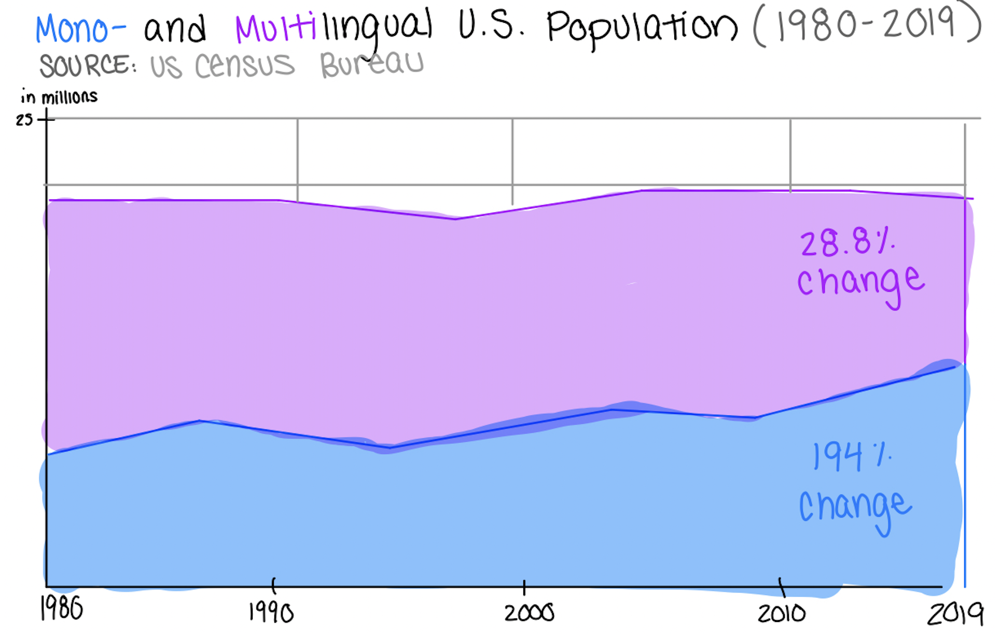
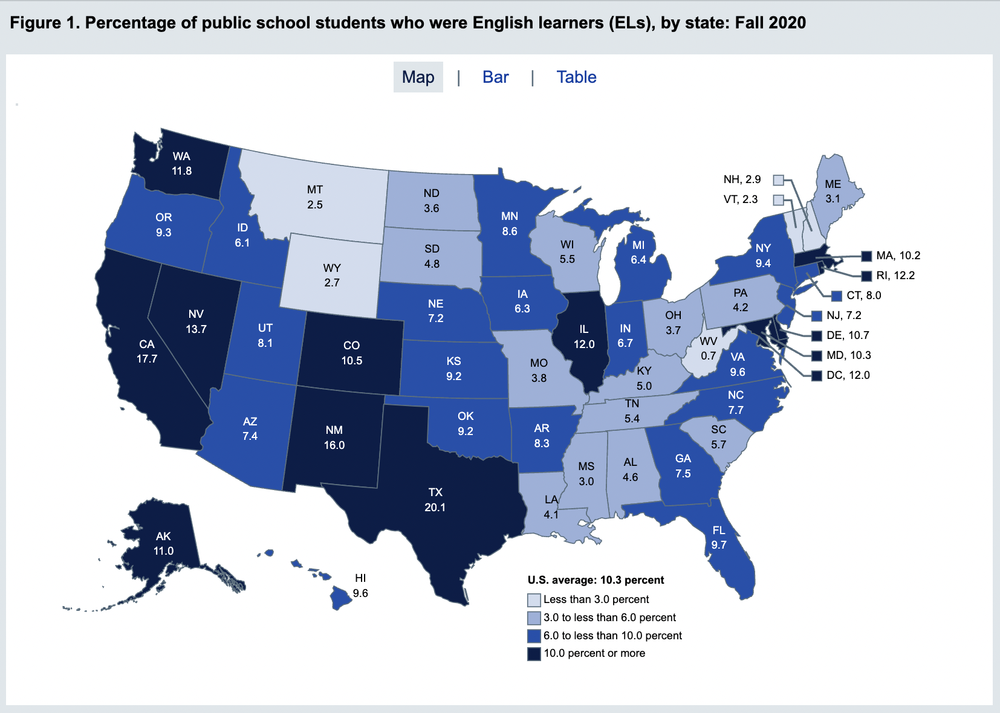
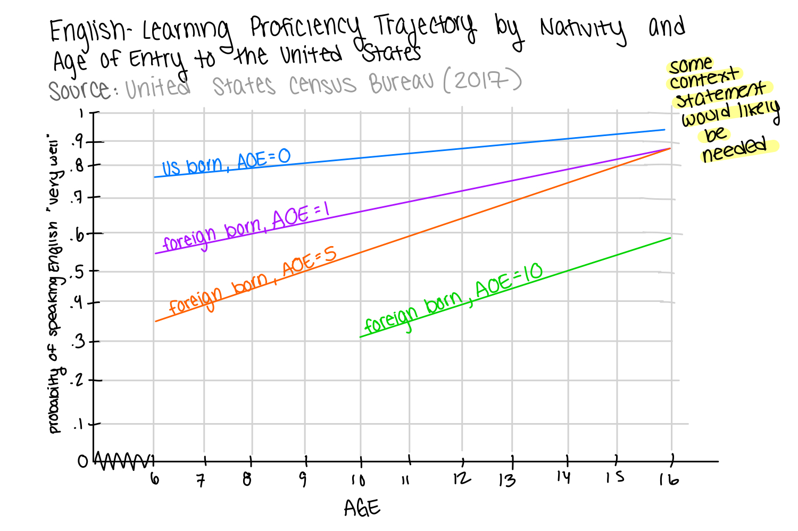
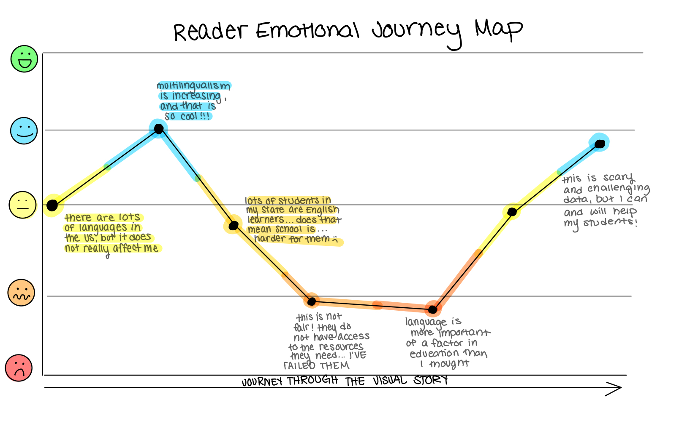

# Final Project Part I: Planning and Research
[Return to Home Page](/README.md)

In this assignment, I will be drawing from my background in linguistics and passion for K-12 education to develop visual storytelling around the necessity of better educational practices regarding native languages in the United States (public) education system. 

According to a 2019 report from the United States Census Bureau, 22% of U.S. residents speak a language other than English at home: a figure which has steadily increased since 1980 (Dietrich and Hernandez, 2022). Speaking to the nation's linguistic diversity, the critical period hypothesis is a well-established and accepted linguistic phenomena which explains that there is a strong negative correlation between the age of second language acquisiton and ultimate grammatical and cognitive proficiency in said second language (DeKeyser and Larson-Hall, 2005). While English is overwhelmingly the language of instruction in the United States, the National Center for Education Statisics reported in 2020 that 10.3%  of public school students (or, 5 million) were classified as "English Learners" ("English Learners in Public Schools," NCES). From these statistics it intuitively follows, then, that "English Learner" children instructed solely in a non-native language may face increased challenges in academic and social proficiency in the classroom: these barriers only increase as a non-English speaking child is exposed to English education at increasing age points.

At present, there is not a large amount of **quantitative** research on the affects of native-language educational practices in the United States, largely due to the fact that the U.S. educational infrastructure is not broadly established to support multilingual learning. However, the nation may learn both of the following from other countries. 
> 1. The importance of native-language or multilingual adaptive education, and
> 2. Best practices to foster multilingualism and educational success

To illustrate, in 2022 European linguists Juliana Bernhofer and Mirco Tonin found that "taking an exam in a second language leads to a loss of points of approximately 9.5%" for university students (Bernhofer and Tonin, 2022). While, of course, these participants were above the K-12 age range that is the present target for U.S.-based change, due to the linguistic critical period hypothesis described above, it may be expected that these students would remain representative of our K-12 students as they continue to age. Further, UNESCO's Worldwide Inequality Database on Education reported in 2023 that having access in reading education to the language a child speaks at home makes one 30% "more likely to read with understanding by the end of primary school than those who do not speak the language of instruction" ("Language Matters, a Lot, GEM Report). As a whole, access to native-lanuage learning and assessment greatly influence not only a child's K-12 academic success, but their future prospects and attitudes towards learning as they continue to age. 

It is my view that English should be treated as _**a**_ language of instruction in U.S. public schools, not _**the**_ language of instruction. Inequitable social and academic opportunities for the ever increasing amount of non-English speaking or proficient youth plagues the U.S. education system, and awareness of the issue for U.S.-based educators and/or policy makers is a monumental first step towards change. 

This visualization assignment will seek to raise awareness of the above-explained challenges using preexisting U.S. and international datasets concerning language and education, as well as present a series of first steps for said U.S.-based educators and/or policy makers. As will be mentioned once again, the precise recommendations are still in development; there is a massive number of potential next steps, and at this stage in the process I am still working on narrowing down what is the most valuable based on my intended audience(s). 

## Initial Sketches and Outline 
**General Guiding Statement:** The preservation of linguistic diversity and non-English learning in the classroom improves K-12 students’ (social belonging and) academic performance. 
> The social belonging aspect of this story is extremely important, but is likely out of scope within the framework of the current assignment; I wish to keep the flow of information as streamlined as possible given the multiple different data sources at play in the story, and I worry that integrating a social perspective would overcomplicate the message. However, I am keeping it in this preliminary guiding statement, with the hope that I can fit it in as applicable due to its holistic relevance.

**Guiding Intended Audience Statements:** 
* As a United States **educator**, I want to know how linguistic diversity in the U.S. affects student performance so that I can best shape my instruction.
* As a United States **education policy-maker**, I want to know how linguistic diversity in the U.S. affects student performance so that I can best shape my advocacy and crafted policy. 

### Tenatative Data Outline (Structured as Questions to be Answered):
The following section has a _general overview_ of the visualization-based story I plan to create. Sketches for specific visualizations are only provided for a selection of the sections thus far, as there is a large amount of data from which stories could be pulled and I am aiming to land on what will be the most impactful as the project continues to develop.

#### 1. What percentage of U.S. citizens speak a language other than English, how has this changed over time?
> **SOURCE:** Dietrich, Sandy and Erik Hernandez. "Language Use in the United States: 2019." _United States Census Bureau_. September 1, 2022. https://www.census.gov/library/publications/2022/acs/acs-50.html.

For this first section of data, I plan to highlight the fact that between 1980 and 2019 the percentage change in monolingual individuals in the U.S. was 28.8%, while the percent chane in multilingual individuals was 194% (Dietrich and Hernandez, 2022). Ultimately, the amount of multilingual individuals in the U.S. is increasing at a disproportionate rate to that of monolingual individuals. This will likely be accomplished with a percent change or change over time area chart with a conclusion pulled out boldly in the text. 

#### 2. What percentage of U.S. K-12 public school students are considered "English Learners"
> **SOURCE:** "English Learners in Public Schools." Preprimary, Elementary, and Secondary Education. _National Center for Education Statistics_. Updated May 2023. https://nces.ed.gov/programs/coe/indicator/cgf/english-learners. 

By and large, I would like the recreate (with credit given, of course) the following visual from the National Center for Education Statistics, presented alongside pulled quote regarding the overall national average and the actual count of how many students this is (to make the overall statistics more staggering or relatable). While doing research, I greatly enjoyed messing with this visualization/dataset, and its interactive nature would likely be quite engaging for policy-makers or educators to understand their own state's place in the overall distribution of data. 

#### 3. How is English-learning affected by age? & What are the effects of time/aging on children's ability to learn English?
> **SOURCE:** DeKeyser, Robert and Jenifer Larson-Hall. "What Does the Critical Period Really Mean?." In _Handbook of Bilingualism: Psycholinguistic Approaches_, edited by Judith F. Kroll and Annette M.B. de Groot, 88 - 108. New York: Oxford University Press, 2005. https://www.researchgate.net/profile/Jyotsna-Vaid/publication/270582623_Clearing_the_cobwebs_from_the_study_of_the_bilingual_brain_Converging_evidence_from_laterality_and_electrophysiological_research/links/57cb245508ae5982518358bd/Clearing-the-Cobwebs-From-the-Study-of-the-Bilingual-Brain-Converging-Evidence-From-Laterality-and-Electrophysiological-Research.pdf.

> **SOURCE:** Dietrich, Sandy and Erik Hernandez. "Language Use in the United States: 2019." _United States Census Bureau_. September 1, 2022. https://www.census.gov/library/publications/2022/acs/acs-50.html.

This section functions largely to pull in the linguistic theory that explains language-based effects on student performance. It is important for audience members to grasp that students are not necessarily performing more poorly in their non-native language as they age because of any individualized cognitive or intellectual barriers, but rather because of innate challenges that arise in language acquisition as children continue to age out of their critical period for second language acquisition. **These challenges, then, can be addressed and productively targeted by educators.** This element of the story can also be further supported by a text-based exploration of the distribution of age-based entry to the United States for K-12 public school students. Overall, this phenomena will likely be best explained by a line graph showing the level of achieved profiency in English based on time in the United States as drawn from data collected and visualized by the United States Census Bureau in their 2019 U.S. language report.

#### 4. What does data suggest on how non-native language instruction affects student performance?
> **SOURCE:** Van Ryzin, Mark J. and Claudia G. Vincent. “Use of Native Language and Culture (NLC) in Elementary and Middle School Instruction as a Predictor of Mathematics Achievement.” _Journal of American Indian Education_ 56, no. 2 (2017): 3–33. https://doi.org/10.5749/jamerindieduc.56.2.0003.

> **SOURCE:** "Language Matters, a Lot." Articles. _UNESCO_. Updated April 6, 2023. https://world-education-blog.org/2023/02/21/language-matters-a-lot/#:~:text=As%20the%20World%20Inequality%20Database,speak%20the%20language%20of%20instruction.

As this section is meant to create some form of emotional response and lead naturally into the call for action, the **negative side** data will be highlighted more significantly. This means, for instance, instead of wording a caption or writeup to highlight that students performed X% better when presented with education in their native language, the linguistic or structural focus will be on how students do X% worse when not presented with education in their native language. This is one of the sections where I am still in the process of determining how to best pull from the breadth of data on this topic. However, I expect simple visualizations (e.g. side by side bar graph) or **simple pulled text quotes or large numbers will be the most effective** in drawing out the relative simplicity and importance of the statistics at hand. If a visualization is required, however, I would likely want to pull out the UNESCO data highlighted in the second-listed source above which illustrates that internationally student dropout rates pre-graduation were positively correlated with a lack of native-language instruction. 

#### 5. How can multilingualism and non-native language be addressed in U.S. education? (CALL TO ACTION)
Once again, this section of the story is still in development due to the large number of potential calls to action based upon who the final audience for the visual storytelling ends up being; multiple potential sources are included in the Research Bibliography section below. For instance, one still-developing success story I am extremely interested in drawing out stems from Mozambique: https://www.usaid.gov/mozambique/documents/usaid-community-engagement-bilingual-education. As a whole, however, I imagine that my call to action will be presented as a series of hyperlinked and briefly summarized resources and/or case studies of success that offer (relatively instant) opportunities to engage with advocating for multilingual education opportunities to foster student success and alter ones mindset to treat English as simply **_a_** language of instruction, not **_the_** language of instruction in the U.S. education system.

The overall journey map for readers is intended to be as follows:

## Method and Medium
As may be surmised by the above layout, I intend to build out a story using **Shorthand**. I have much experience in both journalistic and academic-style writing, and would like to use this assignment as an opportunity to enhance my pre-existing writing skills using a more dynamic visual storytelling method. For the Shorthand page, supplemental visualizations will be developed largely using Tableau, Excel, and Canva: three softwares with which I am always looking to increase my proficiency. I look forward to watching this story I am extremely passionate about develop alongside my increasing comfort with these digital storytelling tools in the weeks to come.

## Research Bibliography
There is a significant amount of data publically available regarding the multiple aspects of the story I am hoping to tell. Census or demographic-based information will be guided largely by the U.S. Census Bureau, UNESCO, and the National Center for Education Statistics. Otherwise, indivdiual linguistic research papers will be highly effective in demonstrating quantative effects of native-language resources on student academic success. As a whole, these disperate data sources will be unified and adapted to represent the intersection of U.S. multilingualism, U.S. educational statistics, linguistic theory, and global perspectives on the role of multilingualism/native-languages in education. The resources I have collected and begun working with thus far are included in a _simple_ annotated bibliography below:

> Bernhofer, Juliana and Mirco Tonin. "The Effect of the Language of Instruction on Academic Performance." Labor Economics 78, no. 1 (October 2022): 1-12. https://www.sciencedirect.com/science/article/pii/S0927537122001099.
* Provides an explanation of how the administration of examinations in non-native vs. native languages affects performance: "taking an exam in a second language leads to a loss in grade points of approximately 9.5%."
* Explicitly notes that a high-profiency in a non-native language does not necessarily eliminate patterns of poorer performance when tested in non-native language

> DeKeyser, Robert and Jenifer Larson-Hall. "What Does the Critical Period Really Mean?." In _Handbook of Bilingualism: Psycholinguistic Approaches_, edited by Judith F. Kroll and Annette M.B. de Groot, 88 - 108. New York: Oxford University Press, 2005. https://www.researchgate.net/profile/Jyotsna-Vaid/publication/270582623_Clearing_the_cobwebs_from_the_study_of_the_bilingual_brain_Converging_evidence_from_laterality_and_electrophysiological_research/links/57cb245508ae5982518358bd/Clearing-the-Cobwebs-From-the-Study-of-the-Bilingual-Brain-Converging-Evidence-From-Laterality-and-Electrophysiological-Research.pdf.
* The critical period hypothesis is time-and-time-again supported in empirical linguistic research, and states that there is a negative correlation between increasing age and overall proficiency in second language learning (predominantly in grammar and pronunciation).
* Instruction for second languages needs to be adapted to the age of the learner, which does not necessarily mean that learners **must** always be taught at a young age in order to achieve any level of success.

> Dietrich, Sandy and Erik Hernandez. "Language Use in the United States: 2019." _United States Census Bureau_. September 1, 2022. https://www.census.gov/library/publications/2022/acs/acs-50.html.
* Between 1980 and 2019 the amount of monolingual speakers in the U.S. saw a 28.8% percent change, while the amount of multilingual speakers saw a 194% change.
* There is a correlation between age of first exposure and U.S. nativity and the probability of achieving full English proficiency in youth (in the dataset, presented as ages 6 - 16).
* 22% of Americans fluently speak a language other than English (commonly, their native language spoken at home) as of 2019.

> "English Learners in Public Schools." Preprimary, Elementary, and Secondary Education. _National Center for Education Statistics_. Updated May 2023. https://nces.ed.gov/programs/coe/indicator/cgf/english-learners.
* In Fall 2020 10.3% of U.S. K-12 public school students (or, 5 million individuals) were English learners.
* The percentage of English Learners nationwide when examined by grade level decreased between kindgergarten (15.0%) and 12th grade (5.6%).
* West Virginia had the lowest percentage of English learners at 0.3%, while Texas had the highest at 20.1%.

> "40% Don’t Access Education in a Language they Understand." Press Release. _UNESCO_. December 2, 2016. https://www.unesco.org/gem-report/en/articles/40-dont-access-education-language-they-understand#:~:text=Paris%2C%2019%20February%20%2D%20A%20new,understand%2C%20how%20can%20you%20learn%3F.
* UNESCO's 2016 Global Education Monitoring Report found that 40% of the global population did not have education access in a language they understood.
* The report notes that students in bilingual schools, such as those in Guatemala, generally have higher retention rates, lower dropout rates, and higher testing scores when compared to other schools / school systems globally.
* The report calls for schools to recognize and adapt to the necessity of native/mother language learning. 

> "Learning Achievement in Reading." Indicators. _UNESCO_. Accessed November 17, 2023. https://www.education-inequalities.org/indicators/rlevel_lowsec#maxYear=2020&minYear=2015&ageGroup=%22rlevel1_lowsec%22&dimension=%7B%22id%22%3A%22speaks_language%22%2C%22filters%22%3A%5B%5D%7D.
* This dataset shows that _reading_ profiency and achievement are positively correlated with exposure to native-language instruction and testing between 2015 and 2020. Of note, this dataset is further referenced in several other UNESCO articles included in this bibliography.

> "Language Matters, a Lot." Articles. _UNESCO_. Updated April 6, 2023. https://world-education-blog.org/2023/02/21/language-matters-a-lot/#:~:text=As%20the%20World%20Inequality%20Database,speak%20the%20language%20of%20instruction.
* Directly pulls and summarizes data from the larger UNESCO report included above.
* Children who are instructed in their native-language spoken at home were found to be 30% more likely to "read with understanding" at the end of primary school than those instruction in a non-native language that was not spoken at home.
* Motivation to return to school is positively correlated with instruction in native-languages(s).
* This article also contains several strong policy recommendations, which will be of use in the continuing development of the final portion of this story.

> "Raise the Bar: Pathways to Multilingualism." _U.S. Department of Education_. Accessed November 20, 2023. https://www.ed.gov/raisethebar/multilingualism-pathways.
* The U.S. Department of Education has indeed addressed the need for increased multilingual/native-language-friendly education practices in the United States as they visualize lower high-school graduation rates for English Learners than fluent English speakers (those who have English as their native language).
* The dataset also calls out that many states have no active dual language or two-way immersion programs for English Learners.
* Calls to action here include: diversifying the multilingual education workforce, applying for ARP funding, and applying for state or federal grants or resources. As a whole, I believe this approach is too broad and offers too many long-term solutions, when change is needed as close to immediately as possible. Thus, these calls to action will largely influence those which I choose to build out in my personal reporting. 

> UNESCO. "From Rights to Country-Level Action: Results of the Tenth Consultation of Member States on the 1960 Convention and Recommendation." Notice. _UNESCO Digital Library_. 2022. https://unesdoc.unesco.org/ark:/48223/pf0000380609.
* This document includes much of the most recent UNESCO data on broad global inequities, which of course includes language and education. The data included in this document is presented here as a larger data resource in the overall scheme of this project.

> "USAID Community Engagement in Bilingual Education." Documents. _USAID From the American People_. Accessed November 20, 2023. https://www.usaid.gov/mozambique/documents/usaid-community-engagement-bilingual-education.
* Due to language diversity in Mozambique, the nation realized that bilingual education in early/primary grades was critical to overall success in reading. As such, bilingual education has become a priority in the nation. Yet, the initiative is directly challenged by a lack of teacher training and understanding of the initiative's importance to student families. USAID draws out a supplemental program to increase knowledge of and positive sentiment around the initiative.

> Van Ryzin, Mark J. and Claudia G. Vincent. “Use of Native Language and Culture (NLC) in Elementary and Middle School Instruction as a Predictor of Mathematics Achievement.” _Journal of American Indian Education_ 56, no. 2 (2017): 3–33. https://doi.org/10.5749/jamerindieduc.56.2.0003.
* In this document, the language of focus is American Indian/Alaska Native (AI/AN) languages, which represents a large amount of specific language-in-education research at play in the U.S. currently.
* Native Language Culture practices in education have a generally positve effect on student academic performance for those "whose families identified more strongly with their Native culture and who were in schools with larger percentages of AI/AN students." This shows that language education must be adapted in line with the specific subsections of languages being spoken and cultures being represented within schools; there is not one universal solution that will help all students, and educational practices must be adapted to the actual students receiving the support or intervention.

> "Why Mother Language-Based Education is Essential." Article. _UNESCO_. April 20, 2023. https://www.unesco.org/en/articles/why-mother-language-based-education-essential#:~:text=Research%20shows%20that%20education%20in,learning%20outcomes%20and%20academic%20performance.
* Once again, this article draws from the datasets collected by UNESCO and also included in this bibliography.
* From UNESCO, native/mother language education increases inclusion and academic performance globally. This is especially prominent and important in primary school education (based on the critical period hypothesis).
* Languages are disappearing at an alarming rate, making their preservation in an educational setting all the more important.
* The impacts of Covid-19 and lack to digital learning opportunities are also greatly accelerating student learning inequities globally. 
