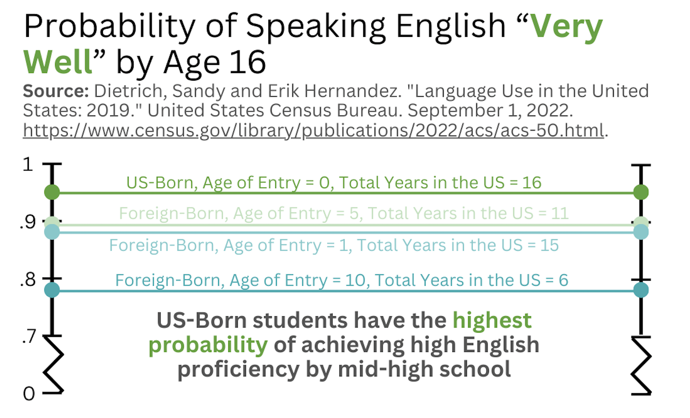

# Final Project Part II: Writeframes and Storyboarding
[Return to Home Page](/README.md)

## Wireframes
As introduced in the [previous section of this assignment](/finalprojectp1.md), the structure of this project is best organized through a series of questions, beginning with crafting a broad understanding of how many individuals in the US speak a language other than English, and ending on a call to action for educators and education policy-makers to take steps to treat English as **a** language of education in the US, not **the** language of education. This question-based format is copied below for reference: 

  1. What percentage of U.S. citizens speak a language other than English, how has this changed over time? (_**Source:** US Census Bureau_)
  2. What percentage of U.S. K-12 public school students are considered "English Learners" (_**Source:** National Center for Education Statistics_)
  3. How is English-learning affected by age? & What are the effects of time/aging on children's ability to learn English? (_**Sources:** Handbook of Bilingualism and US Census Bureau_)
  4. What does data suggest on how non-native language instruction affects student performance? (_**Source:** UNESCO and Journal of American Indian Education_)
  5. How can multilingualism and non-native language be addressed in U.S. education? (_**Potential Source:** USAID_)
     
From these questions and work completed in the preliminary research stages, I was able to construct the forthcoming early draft data visualizations. Notably, these visualizations are designed to be amenable to editing and reworking pending any story restructuring or eventual development of the Shorthand mood and theme.

### Section 1: What percentage of U.S. citizens speak a language other than English. How has this changed?
This visual is designed to represent the percent change of individuals who speak a language other than English at home relative to individuals who speak English at home between 1980 and 2019. Future changes will likely include color alterations and/or working out on Tableau how to alter the ordering of the "blocks" so the more relatively flat dataset (only-English) is on the bottom and the one with more change (non-English) is on top. 

<noscript></noscript><object class='tableauViz'  style='display:none;'><param name='host_url' value='https%3A%2F%2Fpublic.tableau.com%2F' /> <param name='embed_code_version' value='3' /> <param name='site_root' value='' /><param name='name' value='MonoandMultilingualUSPopulation&#47;Dashboard1' /><param name='tabs' value='no' /><param name='toolbar' value='yes' /><param name='static_image' value='https:&#47;&#47;public.tableau.com&#47;static&#47;images&#47;Mo&#47;MonoandMultilingualUSPopulation&#47;Dashboard1&#47;1.png' /> <param name='animate_transition' value='yes' /><param name='display_static_image' value='yes' /><param name='display_spinner' value='yes' /><param name='display_overlay' value='yes' /><param name='display_count' value='yes' /><param name='language' value='en-US' /><param name='filter' value='publish=yes' /></object>
            

### Section 2: What percentage of U.S. K-12 public school students are considered "English Learners"
This visual is meant to be interactive and show the target audience(s) that there are multilingual students actively learning English in every state; this will function to make the story more personalized and targeted to whomever is viewing the piece. Once again, projected changes are likely centered around stylistic and color-based shifts.

<noscript></noscript><object class='tableauViz'  style='display:none;'><param name='host_url' value='https%3A%2F%2Fpublic.tableau.com%2F' /> <param name='embed_code_version' value='3' /> <param name='site_root' value='' /><param name='name' value='percentagepublicschoolenglishlearners&#47;Dashboard1' /><param name='tabs' value='no' /><param name='toolbar' value='yes' /><param name='static_image' value='https:&#47;&#47;public.tableau.com&#47;static&#47;images&#47;pe&#47;percentagepublicschoolenglishlearners&#47;Dashboard1&#47;1.png' /> <param name='animate_transition' value='yes' /><param name='display_static_image' value='yes' /><param name='display_spinner' value='yes' /><param name='display_overlay' value='yes' /><param name='display_count' value='yes' /><param name='language' value='en-US' /><param name='filter' value='publish=yes' /></object>
                

After feedback from my peers in the previous part of this assignment, I felt it was necessary to attempt to use another visual to help narrow down the relevancy for individual engagers beyond just the state level. Using the same dataset, I chose to represent "English Learner" levels by grade level to show that students are facing the effects of poor multilingual-friendly public education at every stage/level of education. 

<noscript></noscript><object class='tableauViz'  style='display:none;'><param name='host_url' value='https%3A%2F%2Fpublic.tableau.com%2F' /> <param name='embed_code_version' value='3' /> <param name='site_root' value='' /><param name='name' value='percentageofpublicschoolenglishlearners&#47;Dashboard1' /><param name='tabs' value='no' /><param name='toolbar' value='yes' /><param name='static_image' value='https:&#47;&#47;public.tableau.com&#47;static&#47;images&#47;pe&#47;percentageofpublicschoolenglishlearners&#47;Dashboard1&#47;1.png' /> <param name='animate_transition' value='yes' /><param name='display_static_image' value='yes' /><param name='display_spinner' value='yes' /><param name='display_overlay' value='yes' /><param name='display_count' value='yes' /><param name='language' value='en-US' /><param name='filter' value='publish=yes' /></object>
           

However, it is also important to capture that though the number of "English Learners" has a notable decline following Grade 1 this is not necessarily because of any massive (relative) success in English profiency as it informs academic success. The previous graphics were quite dense, so I chose to make this visual function more as an infographic to drive home the final point of this section. 

<noscript></noscript><object class='tableauViz'  style='display:none;'><param name='host_url' value='https%3A%2F%2Fpublic.tableau.com%2F' /> <param name='embed_code_version' value='3' /> <param name='site_root' value='' /><param name='name' value='graduationrates_17012941262690&#47;Dashboard1' /><param name='tabs' value='no' /><param name='toolbar' value='yes' /><param name='static_image' value='https:&#47;&#47;public.tableau.com&#47;static&#47;images&#47;gr&#47;graduationrates_17012941262690&#47;Dashboard1&#47;1.png' /> <param name='animate_transition' value='yes' /><param name='display_static_image' value='yes' /><param name='display_spinner' value='yes' /><param name='display_overlay' value='yes' /><param name='display_count' value='yes' /><param name='language' value='en-US' /><param name='filter' value='publish=yes' /></object>
             

### Section 3: How is English-learning affected by age? & What are the effects of time/aging on children's ability to learn English?
Once again, this section is designed to pull in the linguistic theory behind the language-based effects on student performance in order to ensure audience members grasp that students are not necessarily performing more poorly in their non-native language as they age because of any individualized cognitive or intellectual barriers, but rather because of innate challenges that arise in language acquisiton as children continue to age out of their critical periods. In this section, I intended to be able to use a line graph showing the level of achieved proficiency in English based on time in the US. However, I am still working on finding the different individual pieces of data used by the US Census Bureau in their similar report. Thus, for the time being, I have created the following simple visual. 

To reiterate, if I can find all of the component data I need (individual line items from different reports from the U.S. Census Bureau) this will be converted into a line graph in the final stage of this project.

### Sections 4 and 5: What does data suggest on how non-native language instruction affects student performance? & How can multilingualism and non-native language be addressed in U.S. education?
Following the data-heavy layout of the above sections, I believe these sections will be most effective through the usage of pullquotes and stand-out numbers as to not overwhelm audiences and make the conclusion and call-to-action visually straightforward. Rather than repeating myself too exhaustively, the early stages of how these elements may present are included in my Shorthand draft/storyboard included in the next section. 

## Storyboard
Using the visualization drafts included above and plans for data presentation walked through in Part I of this assignment, I was able to build out an early draft of my story using Shorthand. Of course, text is still subject to change and the final resources section still requires formalized language as I continue to hone in on my ultimate call to action. In addition, my final sources list will be updated on the webpage in association with the final stage of this project in order to ensure that it reflects the most up to date picture of the sources I end up using. This is, after all, a draft.

As a whole, major updates I expect to make (in advance of receiving peer feedback) are as follows:
* Edit all text, add more information where applicable, and finalize the resources section. 
* Unite the color scheme and insert more visuals to make the piece less text heavy where applicable.
* Insert final bibliography.
* Find a way to center Tableau graphics and/or make them look better in general.

The draft version may be accessed using the following link: https://preview.shorthand.com/4oMiYmyRNH5PZ1cd. 

## User Research and Interviews
After reviewing my storyboard, I drafted the following questions to ask my solicited participants:

  1. What is this data story telling you? What is your primary takeaway from the story?
  2. Is there anything in particular that works or doesn’t work? Why or why not? What would you differently?
  3. Who do you think the intended audience is for this story?
  5. Is there anything else you would like to share with me about this story? Do any further questions arise from your engagement with the material?

These questions are slightly adapted from those that I asked on a previous assignment, which proved extremely helpful in reworking my visualizations and gathering outside perspectives on the work I had completed thus far. As drawn out in my previous section of this assignment, my primary target audience is K-12 educators, while the secondary audience is education policy makers. The guiding audience statements are included once again below for reference: 

> As a United States educator, I want to know how linguistic diversity in the U.S. affects student performance so that I can best shape my own performance.

> As a United States education policy-maker, I want to know how linguistic diversity in the U.S. affects student performance so that I can best shape my advocacy and crafted policy.

For this reason, I wanted to make sure to interview at least one educator to ensure that the information was digestible and the structure was logical from their (very important) perspective. My remaining interviewee was a peer who has much experience with data visualizations at his place of full time employment; I hoped to be able to get his perspective on the flow of the graphics themselves, not necessarily the body of the story as a whole. 

### Feedback #1: Man, Mid-20s (Data Engineer)
  **1. What is this data story telling you? What is your primary takeaway from the story?** I have learned that many students in america do not speak english as their first language. What's more, the number of these student's is growing. This is a problem because schools are almost universally offered only in English, which leads to decreased learning outcomes for these kids.
  
  **2. Is there anything in particular that works or doesn’t work? Why or why not? What would you differently?** Excellent use of visuals. I was able to connect all of your visuals to the narrative of your story without any of the content becoming overwhelming. I appreciated the consistency of making green the color associated with "English-only" people and the blue/teal being associated with your "English Leaners." 
  
  **3. Who do you think the intended audience is for this story?** Educators or policy makers. 
  
  **4. Is there anything else you would like to share with me about this story? Do any further questions arise from your engagement with the material?** No further questions :) I will be interested to hear about how you wrap up the story once the conclusion is complete. 

### Feedback #2: Woman, Mid-50s (Public School Educator) 
  **1. What is this data story telling you? What is your primary takeaway from the story?** This data is showing that the United States is a linguistically diverse nation. In fact, there is an increase in ELs in every state and the numbers are continuing to grow. My primary take away is the US public education system needs to look at how we can best support the academic needs of this population in order to close the gap between the number of ELs vs. non-ELs who graduate high school in four years.

  **2. Is there anything in particular that works or doesn’t work? Why or why not? What would you differently?** I feel like focusing on the fact that there are ELs in every state shows that this is an issue for all and is a great starting point for this presentation. The visual “Percentage of Public School ‘English Learner’ Students Per State” strengthens this point. I love that there is a graphic for each section to provide a visual representation for the point being made. The color palette is very effective and pleasing to the viewer. I don’t have any recommendations for what you might do differently after viewing the project.

  **3. Who do you think the intended audience is for this story?** I believe the audience for this material might be leaders who are making decisions around funding and staffing for the ever growing EL population in our schools. I believe teachers would also benefit from this information to understand how important it is to meet their language needs in order for them to complete high school and be on a path for success.

  **4. Is there anything else you would like to share with me about this story? Do any further questions arise from your engagement with the material?** As an educator in the public schools, I find this information fascinating. We are understaffed and need additional ESOL teachers to meet the needs of our ELs. I would love to see how funding and staffing for ELs has changed over time in relation to the increase in the EL population in our schools.  

### Feedback #3: Woman, Mid-30s (Public School Educator) 
  **1. What is this data story telling you? What is your primary takeaway from the story?** The data is showing how the population of English Learners is going to continue to grow in the United States, and the US Department of Education needs to make adjustments to better practices to ensure English Learners are gaining ground effectively to learn English. By adjusting these practices, hopefully this will diminish the social and emotional effects ELs are experiencing and result in successful growth and learning.

  **2. Is there anything in particular that works or doesn’t work? Why or why not? What would you differently?** The breakdown of the data with the variety of representations through the graphs works very well. The various graphs and charts show the significance of this issue and give a good representation of the data. The color palette is aesthetically pleasing and does not detract from the information shared. There is nothing I would recommend doing differently at this time.

  **3. Who do you think the intended audience is for this story?** The intended audience for this story is the educational policy makers, curriculum creators and ESOL curriculum teachers throughout the United States. These individuals need to be aware of the growing number of English Learners and how to best fund and equip teachers and resources to meet students’ needs and encourage completion of high school.

  **4. Is there anything else you would like to share with me about this story? Do any further questions arise from your engagement with the material?** As a teacher, I would be curious to know if the number of ESOL teachers has increased like the population of English Learners.  

## Analysis of User Research and Interviews
To begin, I was pleased that all three interviewees seemed to readily grasp the central point of the story, which revolves around the inequities faced by English-Learners / non-native English speakers in the US K-12 public school system. Similarly, the story appeared to have been successful in expressing that the number of English Learners is readily growing in the nation, so inequities will only continue to increase proportionately as the number of English Learners enrolled in public schools continues to increase; all three interviwees mentioned this growth at some point within their responses. 

The second interviewee noted their positive response to the representation of the presence of inequities facing non-native English speakers in every state. Similarly, the third interviewee noted that the graphics-heavy section in the first half of the report functioned well in showing the importance and scale of the issue at hand. I was also pleased to hear that all three participants enjoyed the color scheme: the data engineer pulled out the consistent assignment of color to language group and the two educators noted that the color scheme was aesthetically pleasing and not distracting to the data/story at hand. 

I found it interesting that both teachers noted that while the story is useful for teachers and higher-up decision makers in the education sphere, they both pinpointed staffing of instructors for ELs / ESOL (English as a Second Language) teachers as an intended audience members. I imagine this identification was born out of the fact that these specialized individuals are their primary onsite points of contact for non-native language instruction. While these responses do indeed fit squarely in the scope of my intended audience, I would like to adapt the language of the body text slightly to explicitly address that ideological change should not **only** occur at the level of specialized instructors or policy makers, but rather start in the classroom and work up through every level of the educational system. Further, these responses will likely influence the resources I ultimately select for the final portion of the report. 

Similar to the above point, the mirrored "additional questions" from both of the teachers have made me interested in potentially including a visualization that targets the growth (or lack thereof) of specialized ESOL teachers relative to the growth of English Learners in schools nationwide. For the final revision of the story, I will search for and work to integrate data addressing this gap / potential question identified by members of my intended audience. 

Finally, all three participants snidely remarked via phone or text that they were "big fans" of and "extremely moved by" my to be determined STRONG CONCLUDING STATEMENT. On the whole, the responses were quite unified in their opinions and general tone regarding the story's presentation and its encompassed visualizations. 

Taking into account my own desired changes and the feedback received by the three aforementioned participants, my next steps for revision include the following: 
* Edit all text, add more information where applicable, and **finalize the resources section.** 
* Unite the color scheme on graphics with slight differences from the core colors.
* Insert a visual targeting the presence (or lack of) ESOL teachers in public schools --> _I will also search for potential counts of multilingual educators in the US to juxtapose against the counts of English Learners nationwide. In addition to the presence of ESOL teachers, this data may help draw out the social isolation of English Learners to a degree that I feel is not currently thoroughly enough represented given the severity of the phenomenon._
* Find a way to center Tableau graphics and/or make them look better in general. --> _After prompting, none of the interviewees were bothered by the slightly "off" alignment of the Tableau visuals. As such, I will do the best I can but will not be devastated if they cannot be reasonably aligned as ideally as I would like._
* Insert final bibliography.
